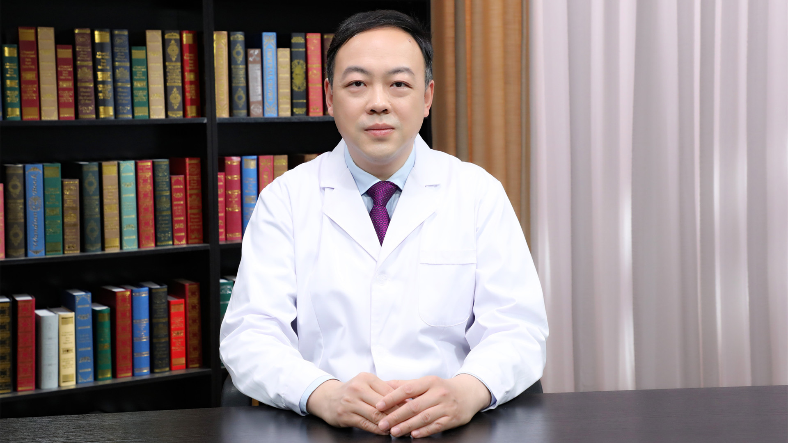

# 颅内动脉瘤的介入治疗

---

## 汪阳 主任医师

首都医科大学附属北京朝阳医院神经外科主任 主任医师 教授 博士和硕士生导师；

中国医师协会神经外科医师分会青年委员会副主任委员；中国医师协会神经介入专业委员会出血性脑血管病专业委员会副主任委员；中国医师协会神经介入专业委员会委员；中华医学会神经外科分会神经介入学组委员；中国研究型医院学会脑血管病专业委员会常务委员；国家卫健委卒中防治专家委员会出血性卒中介入治疗专业委员会常务委员。

**主要成就：** 主持国家自然科学基金2项、省部级课题4项；发表SCI论文10余篇、中文核心期刊论文20余篇。

**专业特长：** 擅长脑血管疾病的介入和外科治疗，包括颅内动脉瘤、血管畸形、颅内外血管狭窄等。

---
