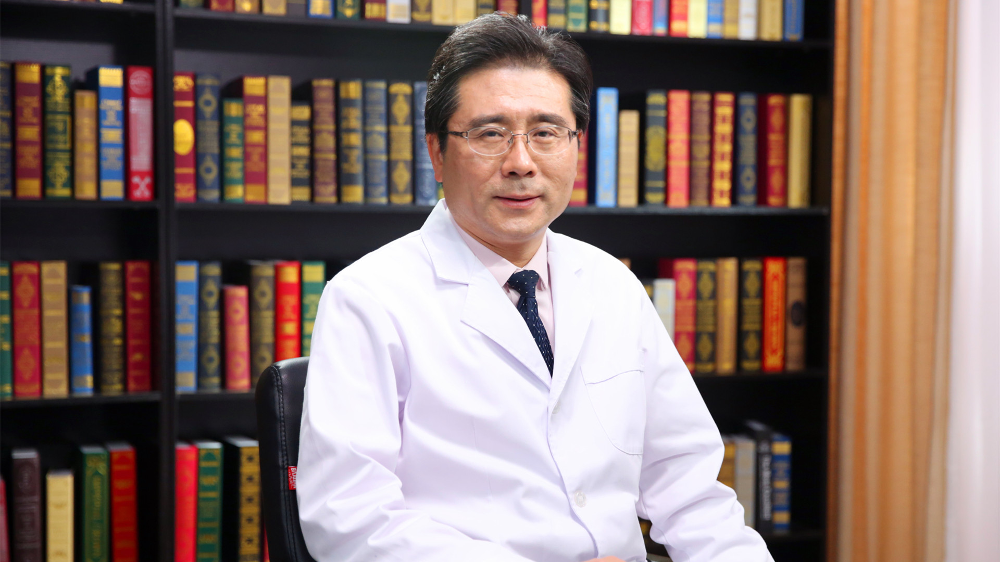

# 6.41 脑静脉窦血栓

---

## 王大明 主任医师

北京医院神经外科主任 主任医师 博士生导师；

中华医学会神经外科学分会委员；中国医师协会介入医师分会常委；北京医学会神经外科学分会副主任委员；中国人民政治协商会议全国委员会第十一 十二 十三届委员。

**主要成就：** 承担完成国家、省部级科研等项目7项，发表学术论文100余篇，其中SCI收录16篇，累计影响因子260多分；获得省部级科学技术奖5项；获得卫生部“有突出贡献中青年专家”称号；享受国务院特殊津贴。

**专业特长：** 擅长脑与脊髓血管病的介入微创治疗；在国内率先开展了颅内动脉狭窄的支架治疗、脑动脉瘤的GDC栓塞治疗等；治疗颅内外血管狭窄、血管闭塞、血管畸形、各类动静脉瘘和脑动脉瘤等8000多例次。

---
