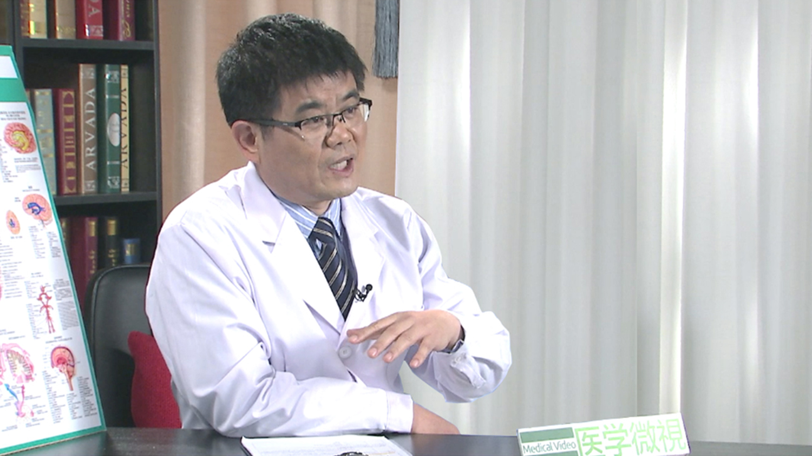

# 6.45 脑卒中

---

## 赵性泉 主任医师

首都医科大学附属北京天坛医院神经病学中心主任、血管神经病学科主任 党支部书记；

首都医科大学教授 博士研究生导师；中国卒中学会卒中与眩晕分会主任委员；中国研究型医院学会眩晕病专业委员会副主任委员；中华预防医学会卒中预防与控制专业委员会委员；中华医学会北京神经病学分会第五届委员会脑血管病学组委员；中华医学会北京神经病学分会常委；北京医学会眩晕专业委员会 副主任委员；北京市职业病诊断鉴定专家库专家成员；中华脑血管病杂志（电子版）副总编辑。

**主要成就：** 2010年当选北京市卫生系统高层次卫生技术人才学科骨干；2014年当选北京市卫生系统高层次卫生技术人才学科带头人。

**专业特长：** 擅长脑血管病的诊治，创立中国首家卒中单元和卒中单元数字化管理系统，对该领域的学术进展有重要的推动作用和学术影响力。

---
