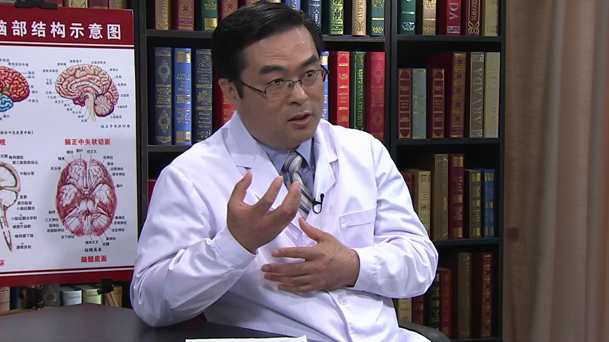

# 脑卒中后疼痛

---

## 胡永生 主任医师

首都医科大学宣武医院功能神经外科副主任 主任医师 硕士生导师；

中华医学会疼痛学分会中枢痛学组副组长；中国抗癌协会肿瘤微创治疗专业委员会疼痛分会常务委员；北京市神经外科学会青年委员；国家自然科学基金评审专家；北京市健康教育专家；《中国疼痛医学杂志》常务编委；《中华神经医学杂志》特约编委；《中华神经外科杂志》审稿专家。

**主要成就：** 2003年入选北京市科技新星计划；2009年入选北京市卫生系统高层次卫生技术人才培养计划；承担省部级课题2项；获得省部级成果6项；参编专著8部、译著3部；发表论文30余篇；

**专业特长：** 擅长中枢性疼痛、臂丛神经损伤后疼痛、幻肢痛、癌性痛、头痛、三叉神经痛、舌咽神经痛以及面肌痉挛、脑瘫、帕金森病、周围神经压迫和肿瘤、帕金森病、肌张力障碍、震颤、癫痫、强迫症、抽动症等疾病的诊治。

---
