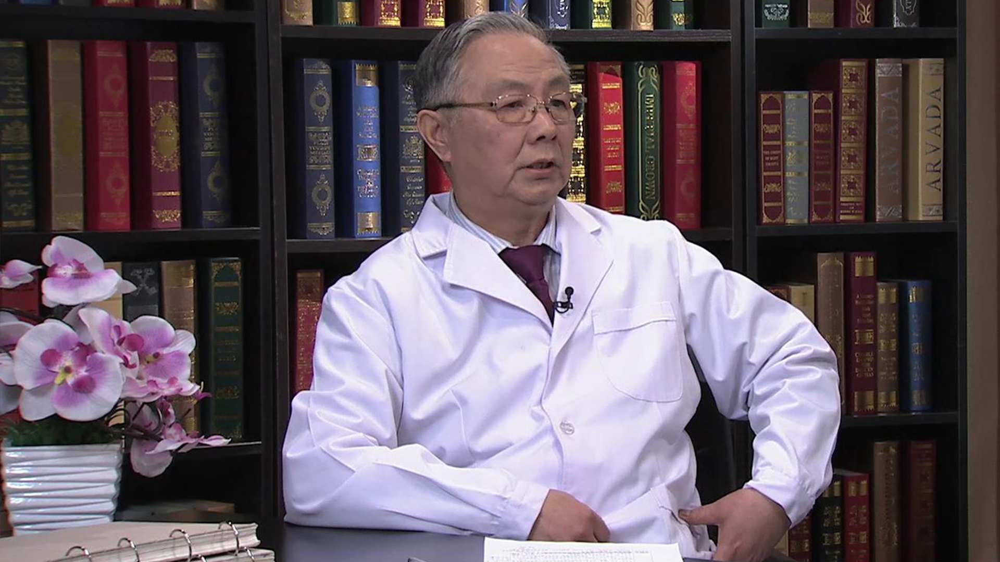

# 脑卒中偏瘫的康复治疗

---

## 王茂斌 主任医师

首都医科大学宣武医院康复医学科原主任 现顾问；

北大医疗康复医院现首席专家；卫生部北京医院康复医学科原主任；中国医师协会康复医师分会原副会长 现名誉会长；中国康复医学会原副会长 现名誉副会长；北京康复医学会原会长 现名誉会长。

**主要成就：** 获省部级科技成果二、三奖三项；发表论文40余篇，SCI论文3篇；著有《偏瘫的现代评价和治疗》（1990），《心脏疾病的康复医疗学》（2000），《康复医学》（全国高等医学院校统编教材，2002），《心肺病康复治疗图解》（2002），《康复专业人员培训教材》（2005），《脑卒中的康复医疗》（2006），《康复医学》（2009），《神经康复学》（2009），《康复医学科诊疗规范》（2012），《卒中后走起来》（2012），即将主编出版《中华医学百科全书康复医学分卷》（2017，已付印刷）。

**专业特长：** 擅长心、脑血管病的康复医疗。

---
