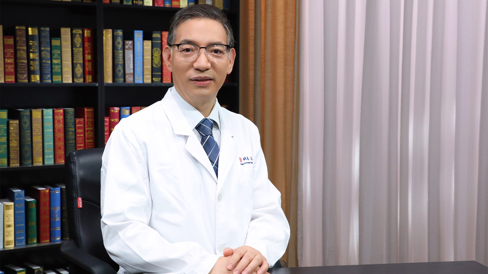

# 缺血性脑卒中的溶栓治疗

---

## 李小刚主任医师

北京大学第三医院神经内科副主任 主任医师 首都机场院区副院长 教授 研究生导师；

中华医学会神经病学分会神经康复学组副组长；中华医学会北京神经病学分会介入学组委员；中华医学会老年医学分会神经病学专业组委员；中国医师协会神经内科医师分会康复学组副主任委员；中国卒中中心管理指导委员会委员兼副秘书长；北京脑血管病防治协会副会长。

**主要成就：** 发表论文80多篇，副主编或参编专著4部，主译或参译专著3部；获得军队科学技术进步二等奖一项。

**专业特长：** 从事神经内科临床、教学及科研工作30年，具有丰富的临床经验。在缺血性卒中静脉rt-PA溶栓方面全国领先，首创静脉rt-PA静脉溶栓联合神经保护剂（依达拉奉）治疗缺血性卒中的研究；主攻方向为脑血管疾病、帕金森氏病、运动神经元病等疑难杂症。

---
