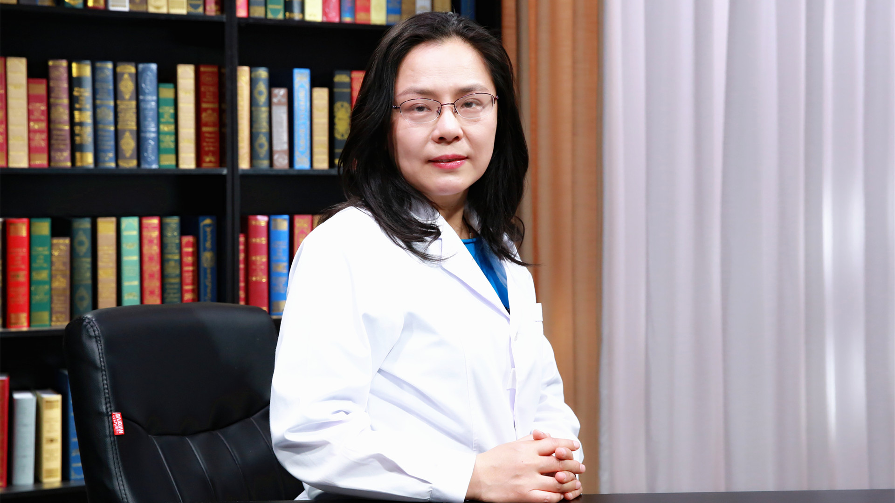

# 双心病

---

## 刘梅颜 主任医师

首都医科大学附属北京安贞医院心内六科副主任 主任医师 医学博士 博士生导师；

中国医师协会心血管分会双心专业委员会主委；中国医师协会全科分会双心学组组长；中国中西医结合学会心血管分会双心学组组长；中国心理卫生协会心身医学专业委员会副主任委员；北京医学会心脏心理分会主任委员。

**主要成就：** 国家 “健康，从心脏到心理”项目负责人；《中华心血管病杂志》通讯编委，《中国心理卫生杂志》《中国综合临床》杂志、《中国医药》杂志编委；发表论文60余篇，专著及参编著作40余部。

**专业特长：** 长期从事临床科研工作，主要研究方向为心血管重症疾病的临床诊断和处理、高血压发病机制及临床处理、精神心理因素对心血管疾病的影响与处理、心血管检验发展研究等。

---
