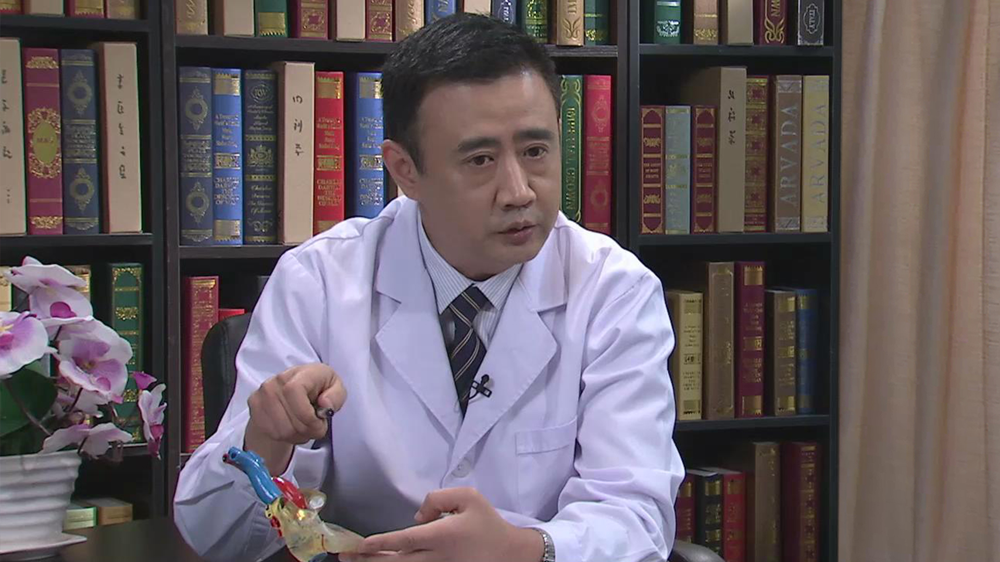

# 室间隔缺损

---

## 张辉 主任医师

首都儿科研究所附属儿童医院心脏外科主任 主任医师 硕士研究生导师；中华医学会小儿外科学分会第七届青年委员会委员；北京医学会小儿外科学分会第七届委员会委员。

**主要成就：** 获北京市卫生局科技成果二等奖1项；完成科研课题2项，发表论文40余篇，以第一作者发表论文12篇，参编专业书籍3部。

**专业特长：** 从事小儿先天性心脏病外科专业20余年；擅长低龄、低体重复杂重症先心病婴幼儿及新生儿手术治疗；主刀完成各种先心病手术2500余例，手术成功率接近99%；目前致力于先心病合并多脏器畸形（染色体综合征先心病）的一期外科手术治疗研究。

---
