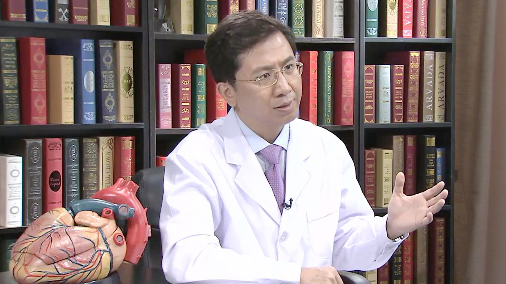

# 6.57 室性早搏

---

## 刘兴鹏 主任医师

主任医师 教授 博士生导师 首都医科大学附属北京朝阳医院心律失常科主任兼心脏中心副主任；

 中华医学会心电生理和起搏分会委员兼全国房颤工作组成员； 中国医师协会心律失常工作委员会常委兼副总干事； 北京医学会心电生理和起搏分会常委； 哈特瑞姆心律专科医生集团创始人。

**主要成就：** 国家科技进步二等奖（2项）； 北京市科技进步三等奖（1项）； 中华医学科技奖三等奖（1项）； 北京青年五四奖章获得者（2011年）； 北京市劳动模范（2015年）； 全国优秀科技作者（2012年）； 茅以升北京青年科技奖（2010年）。

**专业特长：** 擅长房颤导管消融治疗。临床实践中，倡导房颤导管消融术式的个体化和全程关爱治疗模式，通过房颤治疗团队的协同和制度化的随访流程，使得患者在房颤消融术前、围术期和术后均得到专业治疗团队的指导，从而最大程度的降低手术并发症，并提高治疗依从性。

---
