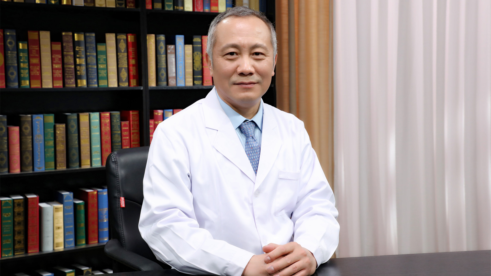

# 6.59 先天性心脏病

---

## 李守军 主任医师

中国医学科学院阜外医院小儿心脏外科中心主任 小儿心外科一病区主任 主任医师 教授 博士生导师 享受国务院特殊津贴；

国家卫生健康突出贡献中青年专家；“新世纪百千万人才工程”国家级人选；新华网首届50名中国好医生；美国胸心外科协会会员；中国医师协会心血管外科学分会先天性心脏病委员会副主任委员；中华医学会小儿外科学分会委员会心脏专业学组副组长；国家心血管病专家委员会先心病专业委员会常务副主任委员。

**主要成就：** 主持“十三五国家重点研发计划”项目、“国家自然科学基金”面上项目、“首都医学发展基金”项目和“首都临床特色应用研究专项计划”项目，承担“十一五、十二五等国家科技支撑计划”子课题、“973计划”子课题等多项国家级和省部级科研课题；荣获国家科技进步奖2项，北京科学技术奖3项，中华医学科技奖1项。

**专业特长：** 擅长复杂、危重先天性心脏病的外科治疗；从事先心病外科30年，完成各类心脏手术超万例，手术成功率居国际领先水平；带领的小儿心脏外科中心团队年手术量超过4500例，成为全球手术量最多的先心病诊治中心；在复杂先心病外科治疗领域屡有术式创新、诊治模式创新，引领专业领域的发展。

---
