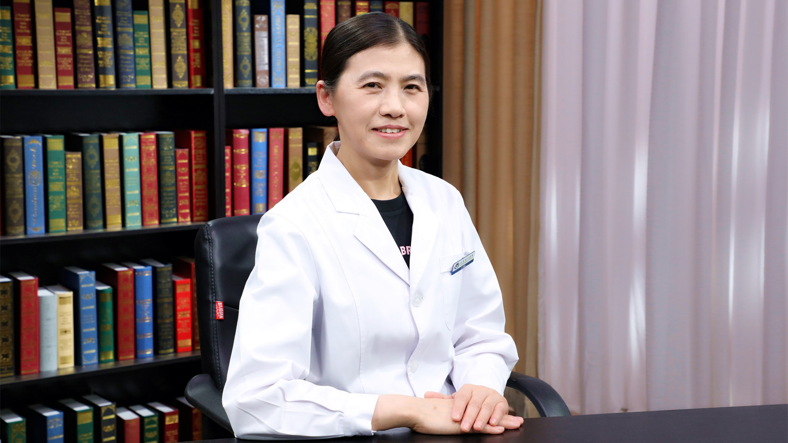

# 小儿肺动脉高压

---

## 刘桂英 主任医师

首都医科大学附属北京安贞医院儿科主任 主任医师 教授 医学博士 博士生导师；

中国研究型医院学会心血管影像专业委员会儿科学组组长；中国妇幼保健协会精准医学专业委员会委员；北京医师协会儿童重症医师分会理事；北京医学会早产与早产儿医学分会委员；北京医学会罕见病分会早发罕见病学组委员；北京市住院医师规范化培训专业委员会全科专业委员；北京市医院管理中心儿科学科协同发展中心执行委员会委员；《中国循证心血管医学杂志》编委。

**主要成就：** 发表论文80余篇，参编教材3部，参编论著3部；获省市级成果奖2项。

**专业特长：** 擅长小儿常见病、多发病及疑难杂症的诊治工作，尤其是在小儿心血管疾病、新生儿疾病、呼吸系统疾病方面，在新生儿及儿童心肌疾病、川崎病早期诊断、精准治疗、全生命周期管理方面独具特色。

---
