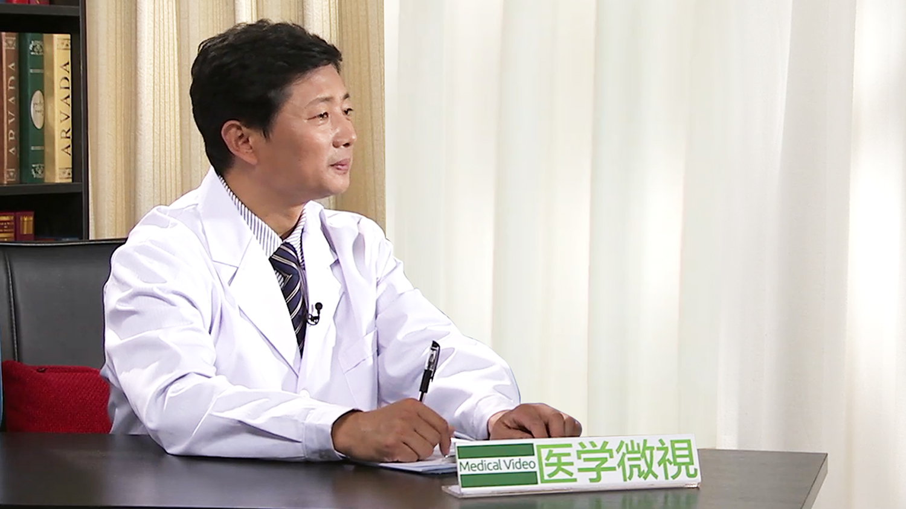

# 心绞痛

---

## 吴永健 主任医师

中国医学科学院阜外医院冠心病中心主任 心脏内科主任医师；

中国医学科学院北京协和医学院博士研究生导师；中国医师协会心脏重症专家委员会副主任委员;中华医学会心血管病学分会介入心脏病学组成员;海峡两岸医药卫生交流协会心脏重症专家委员会副主任委员。

**主要成就:**  《中国循环杂志》《中国介入心脏病学杂志》编委，《中华心血管病杂志》通讯编委；主持的“中国冠脉介入术后长期管理系统”已部分进入科技部重大攻关计划，在心血管疾病的基础研究领域先后承担多个国家、省部级课题。

**专业特长:**  擅长处理各种疑难和复杂冠心病，近十余年为国内经桡动脉冠脉介入治疗手术量最大的术者；擅长复杂病变治疗，在国内率先开展OCT、FFR、旋磨技术，是国家心血管病中心IVUS、OCT、FFR培训主要负责人，国家冠脉介入治疗培训基地负责人，中国旋磨俱乐部负责人，医学会冠脉介入治疗组成员。

---
