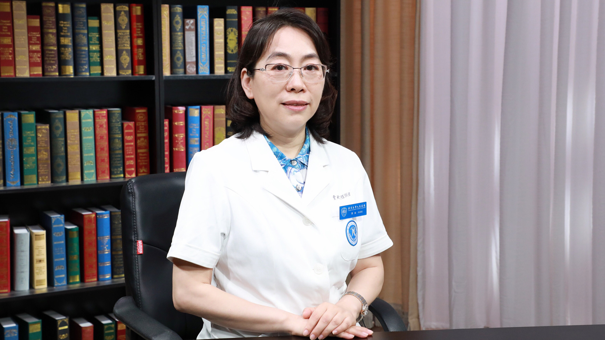

# 心肌损伤相关检查

---

## 贾玫 主任医师

北京大学人民医院检验科副主任 主任医师 硕士生导师；

中国医师协会检验医师分会总干事（常务委员）；中国医师协会检验医师分会动脉粥样硬化检验医学专家委员会主任委员；中华医学会检验医学分会委员；中华医学会检验医学分会生化学组副组长；《中华检验医学杂志》《临床肝胆病杂志》《中华临床实验室管理电子杂志》等杂志编委。

**主要成就：** 近5年来以第一作者或通讯作者发表SCI及核心期刊文章30余篇；著书主编1部、主译1部、副主编4部，参编10余部；以课题负责人承担3项基金。

**专业特长：** 擅长临床生化检验技术，致力于心脑血管疾病的发病机制及危险因素研究。

---
