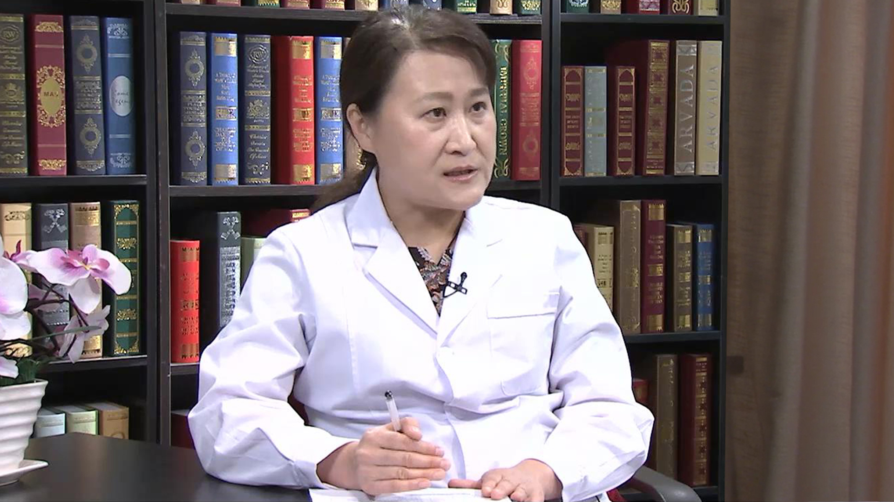

# 心力衰竭

---

## 康连鸣 主任医师

中国医学科学院阜外医院59病房主任 主任医师。医学促进会心血管精准医学会委员。

**主要成就：** 参与研究多项重大国家科研课题，牵头完成国家“社区心力衰竭病例管理规范研究”和“社区冠心病病例管理规范研究”；是北京市科委重大疾病课题“心力衰竭人群监测和心血管病防治网络的建立与防治规范化方案的研究”主要完成人；发表论文30余篇，参加编写多项专著。

**专业特长：** 长期从事心血管内科临床诊疗工作。 擅长心血管疾病如心力衰竭和各种心律失常；高血压；冠心病，以及心血管危重症的诊断及抢救。

---
