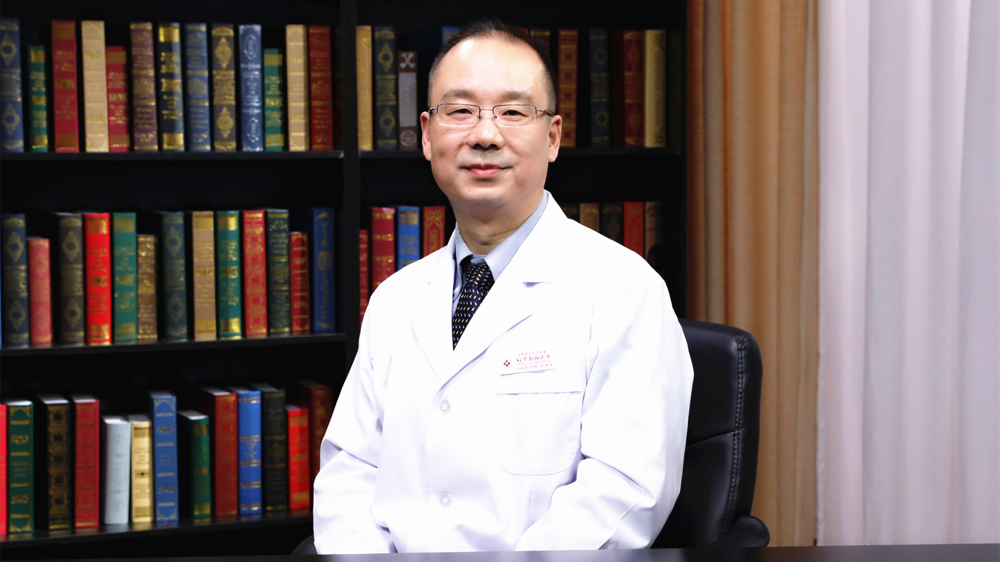

# 心内科症状-呼吸困难

---

## 张建军 主任医师

首都医科大学附属北京朝阳医院（西院）心内科主任 主任医师 硕士研究生导师；

海峡两岸医药卫生交流协会老年医学专业委员会副主任委员；中华医学会心电生理和起搏分会委员；中国医师协会心血管内科医师分会委员；中华医学会心血管病学分会委员。

**主要成就：** 获得北京市自然科学基金及国家自然科学基金2项；北京市科技进步二等奖2项；曾获得北京市青年技术能手称号；发表论文60余篇。

**专业特长：** 擅长心律失常的射频消融、起搏器治疗缓慢性心律失常、冠心病的药物与介入治疗，积累了丰富的经验。

---
