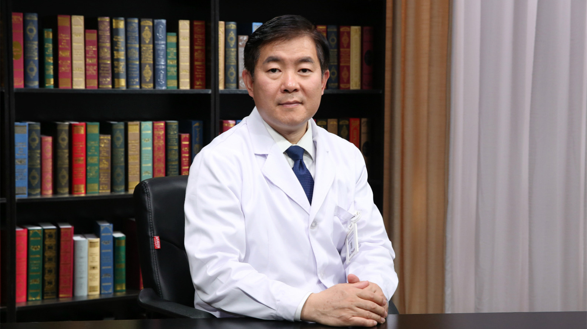

# 6.79 心血管的放射影像检查（冠脉CT）

---

## 吕滨 主任医师

中国医学科学院阜外医院放射影像科主任 主任医师  医学博士 博士生导师；

国际心血管CT协会（SCCT）理事及中国区委员会主席；亚洲心血管影像学会（ASCI）副主席及执行委员会委员；国家卫生计生突出贡献中青年专家；中国青年科技工作者协会常务理事。

**主要成就：** 获得部级以上科技成果奖6项，包括中华医学科技奖、中国青年科技奖、北京市科技进步奖、卫生部科技进步奖；获得国家级项目6项，省部级项目4项；百千万人才工程国家级人选，“新世纪优秀人才支持计划”人选；获得北京市科技新星称号；主编、参编专著10余部，包括国家级专业规划教材；发表正式学术期刊论文160余篇，包括SCI论文60篇。

**专业特长：** 擅长心血管病影像诊断和结构性心脏病介入诊疗，尤其对冠心病、主动脉疾病、先天性心脏病CT诊断，有较为深入的研究。

---
