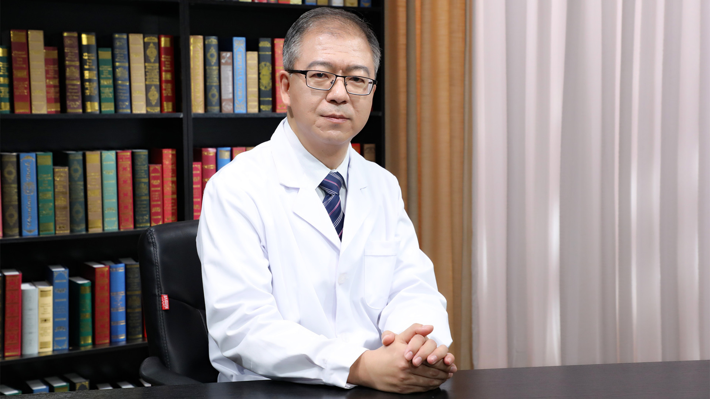

# 心脏瓣膜修复和置换

---

## 王怀斌 主任医师

北京医院心血管外科主任 主任医师 教授 研究生导师；

亚洲心脏瓣膜病学会中国分会心脏瓣膜病介入治疗技术学术委员会委员；北京医学会心脏外科分会第一届青年委员；北京医学会鉴定专家；《中华胸心血管外科杂志》通讯编委；北京大学医学部临床医学专业理论授课教师及临床指导教师 医患沟通教研室教师。

**主要成就：** 先后参加十二五“国家科技支撑计划”项目、“北京市科技计划课题”等多项国家级和省、部、局级课题研究12项；发表学术论文30余篇，参加专著编译2部；获得国家实用新型专利授权1项。

**专业特长：** 从事心脏外科工作20余年。专注于多种术式冠状动脉搭桥手术，室壁瘤切除心室成型，心脏瓣膜修复成型及置换手术，心脏手术同期房颤射频消融，胸主动脉疾病的手术治疗，缩窄性心包炎、心包剥脱及心脏肿瘤切除手术，成人先天性心脏病矫治手术，先天性心脏病微创介入封堵手术，经导管主动脉瓣植入术等。尤其在高龄、危重、心功能不全、肾衰以及多合并症的冠心病、瓣膜病手术治疗方面具有丰富经验。

---
