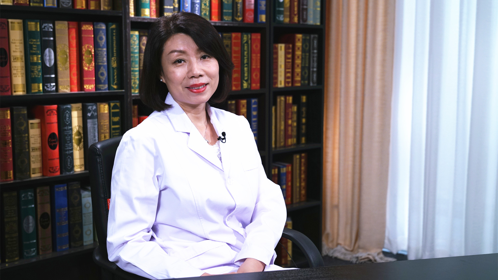

# 心脏超声（超声心动图）检查

---

## 马宁 主任医师

首都医科大学附属北京儿童医院心脏超声科主任 主任医师 硕士生导师；

中国超声医学工程学会第一届儿科超声专业委员会副主任委员；中国医师协会超声医师分会儿科专业委员会常委；中国超声医学工程学会第一届生殖健康与优生优育超声专业委员会常委；中国医促会出生缺陷防控专业委员会委员。

**主要成就：** 近年发表国家级核心期刊及SCI论文20余篇，参编专著8册；承担国家自然科学基金委员会、北京市科学技术委员会及北京市卫计委高层次人才学科骨干资助项目。

**专业特长：** 擅长心脏及大血管疾病的超声诊断，包括胎儿心脏产前超声检查以及新生儿、儿童和成人先天性心脏病、瓣膜病、冠心病、心肌病等心脏疾病的超声诊断。

---
