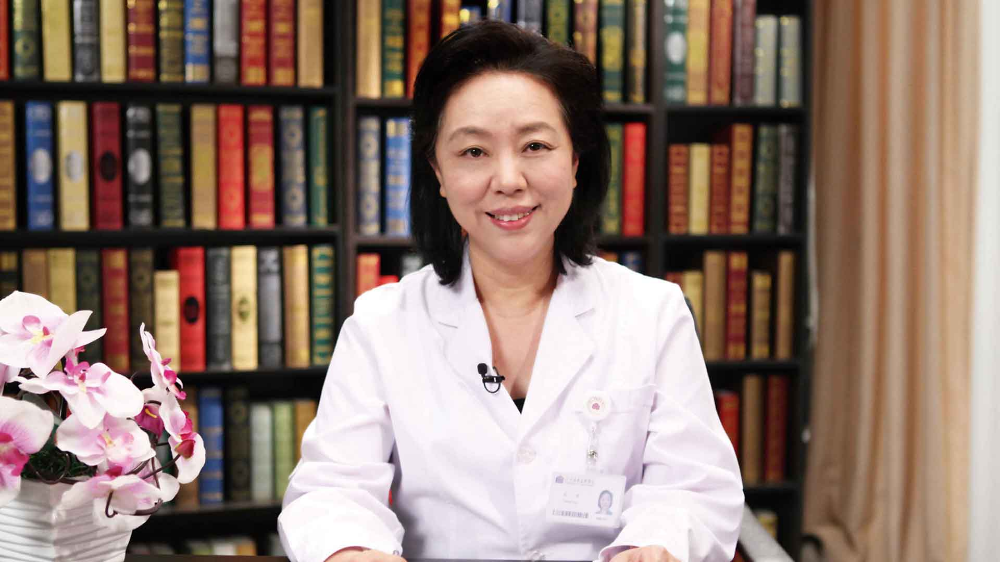

# 心脏猝死

---

## 张萍 主任医师

清华大学附属北京清华长庚医院内科部副部长 心内科主任；

中国生物医学工程学会心律分会常委兼秘书长；中国医促会心律与心电分会副主委；中华医学会起搏与电生理分会委员；中国医师协会心律分会委员；中华医学会心血管病分会心律失常学组委员;中国科协全国首席科学传播专家。

**主要成就：** 发表论文110余篇；2013年获中国心律学会颁发的“中国起搏杰出贡献奖”；先后承担“十二五”科技支撑计划、国家自然科学基金等10余项国家及省部级课题，获中华医学科技三等奖、华夏医学三等奖、教育部自然科学二等奖、北京市科技进步二等奖各一项。

**专业特长：** 擅长各类心律失常及冠心病、心衰、心肌病、高血压及疑难危重心血管疾病诊治， 在晕厥猝死防治、心力衰竭器械治疗及遗传性心血管疾病诊治方面具有丰富的经验。

---
