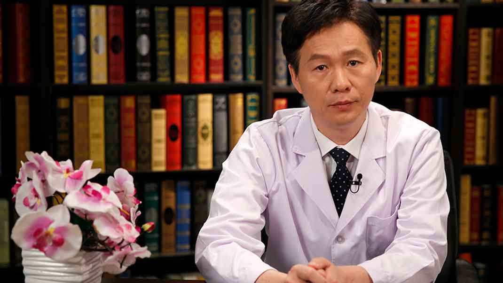

# 心脏康复

---

## 李瑞杰 主任医师

北京市第一中西医结合医院院长 心内科主任医师 硕士研究生导师；

中国中医药研究促进会中西医结合心血管病预防与康复专业委员会主任委员；中国医师协会心血管内科医师分会常委委员；中华医学会健康管理学分会委员。

**主要成就** ：参加国家和省（市）级科研项目10余项；曾荣获北京市劳动模范、首都劳动奖彰等称号；获省（市）和区级科技进步奖7项；参与著书20余部，国内外专业杂志发表学术论文100余篇。

**专业特长：** 从事心血管疾病的临床和研究工作30多年，对动脉粥样硬化疾病和心力衰竭有较深入研究。近年来致力于心血管疾病的基层防治研究、健康管理和心脏康复工作，开创性在国内率先开展中西医结合心脏康复，他领导的“北京市中西医结合心脏康复中心”处于国内引领水平。

---
