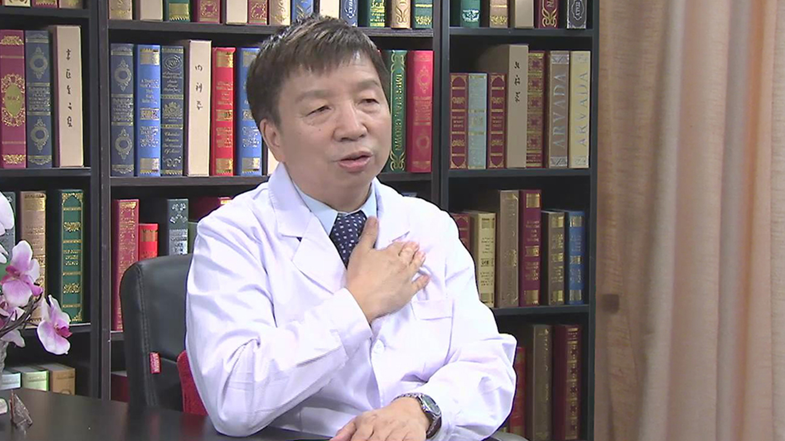

# 早搏

---

## 杨新春 主任医师

首都医科大学附属北京朝阳医院心脏中心主任、主任医师、博士生导师；

2004年始为享受政府特殊津贴专家；中华医学会内科学分会常委；中华医学会心血管病分会委员；中华医学会心电生理和起搏分会常委；中国医师学会心血管病分会常委。

**主要成就及论文编著：** 获中华中医药学会科技一等奖1项，国家科技二等奖1项，中华医学三等奖2项，北京市科技二等奖1项，北京市科技三等奖2项；在国内外刊物上以第一作者/通讯作者发表论文101余篇，SCI文章11篇；主编《急性冠脉综合征》《现代心血管药物与临床》《心力衰竭-临床与实践》等书。

**专业特长：** 擅长心血管病的诊治。在介入心脏病学领域颇有造诣，对房扑、特发性室速、房颤的射频消融治疗方面做出较突出的贡献，完成射频消融治疗心律失常、起搏器植入及冠脉支架手术2000例以上。

---
