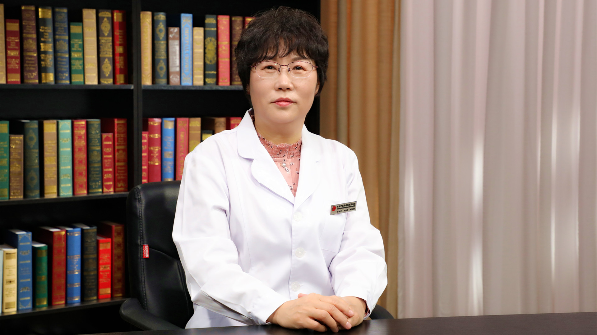

# 中医治疗冠心病

---

## 徐凤芹 主任医师

中国中医科学院西苑医院副院长 主任医师 博士生导师；

中国中医科学院老年医学研究所所长 首席研究员；中医心血管专业学科带头人；岐黄学者 北京大学教授；第六批全国名老中医药专家学术经验继承指导老师；中国中西医结合学会虚证与老年医学专业委员会主任委员；中国老年学和老年医学学会中西医结合分会主任委员；国医大师陈可冀院士学术继承人；海淀区政协副主席 北京市人大代表 全国政协委员。

**主要成就：** 承担科技部重点研发计划和国家自然基金及省部级课题10余项；发表学术论文100余篇，主编医学著作3部；培养硕士及博士研究生50余人，曾先后获得各种表彰及奖励十余项。

**专业特长：** 从事中西医结合临床医疗、科研及教学工作30余年，擅长运用中西医结合的方法诊治心血管病及老年病。

---
