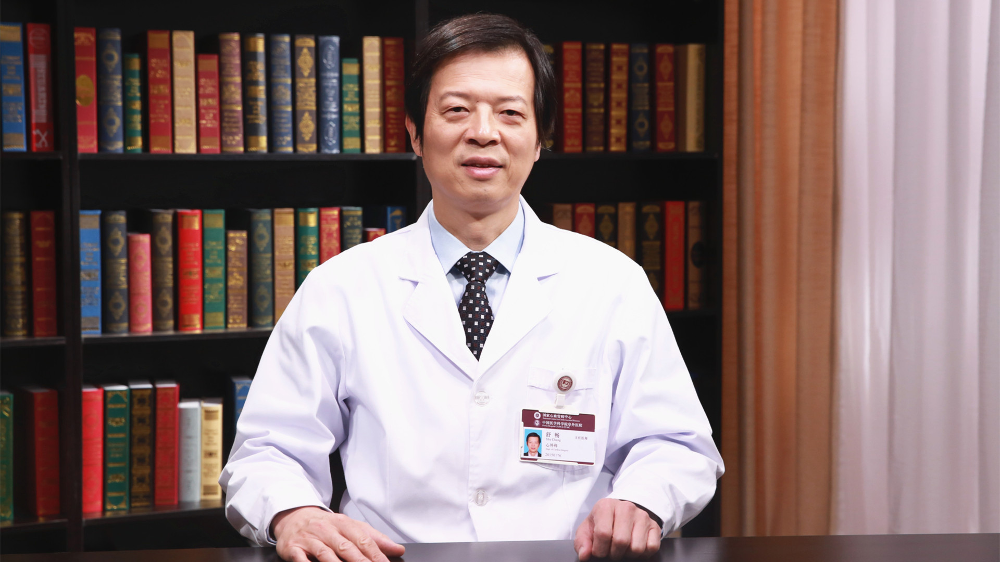

# 主动脉疾病外科治疗的微创化进程

---

## 舒畅 主任医师

中国医学科学院阜外医院血管外科中心主任 主任医师 ；

斯坦福大学医学院血管外科博士后 博士生（后）导师；国家心血管病专业质控中心专家委员会血管外科专家工作组组长；国家心血管病专家委员会血管外科专业委员会主任委员 ；美国血管外科学会（SVS）国际委员 。

**主要成就：** 发表SCI论文50余篇；2008年及2014年分别获得省部级科学技术进步三等奖、一等奖；2012年作为该年度唯一外科医师被评为CMB（美国中华医学基金会）杰出教授。

**专业特长：** 致力于血管疾病的基础与临床研究，擅长主动脉疾病、外周动脉疾病的诊治，主刀完成主动脉疾病介入微创手术2000余台，率先在国内开展一系列前沿技术，是第一位在国际上报道“烟囱”技术微创治疗主动脉弓部夹层的中国专家，受邀赴三大洲14个国家进行手术演示150余台。

---
