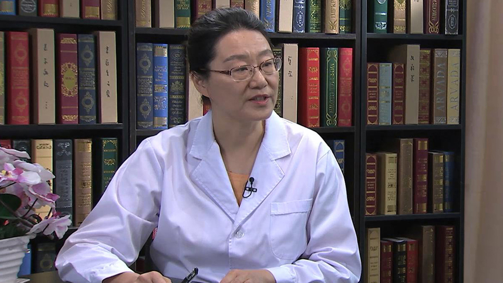

# 矮小症

---

## 李辉 主任医师

首都儿科研究所生长发育研究室主任 博士生导师；中华医学会儿科学分会内分泌遗传代谢学组委员；中华预防医学会儿童保健分会儿童生长发育营养学组副组长；中国医师协会青春期医学专业委员会常委；中国优生科学学会理事；中国优生优育协会儿童发育专业委员会委员；中国优生优育协会小儿营养专业委员会委员；北京医学会早产与早产儿分会委员。

 **主要成就：** 发表中英文研究论文80余篇，其中英文12篇；主持研究制定中国0-18岁儿童生长标准及生长曲线，以第一完成人获得“第六届宋庆龄儿科医学奖”及“首届全国妇幼健康科技成果奖”。

 **专业特长：** 从事儿童生长发育研究及相关临床工作30余年，擅长儿童体格生长和智力发育的评价与促进、儿童保健及科学育儿指导、生长发育偏离/生长发育异常的诊断及干预治疗等。

---
