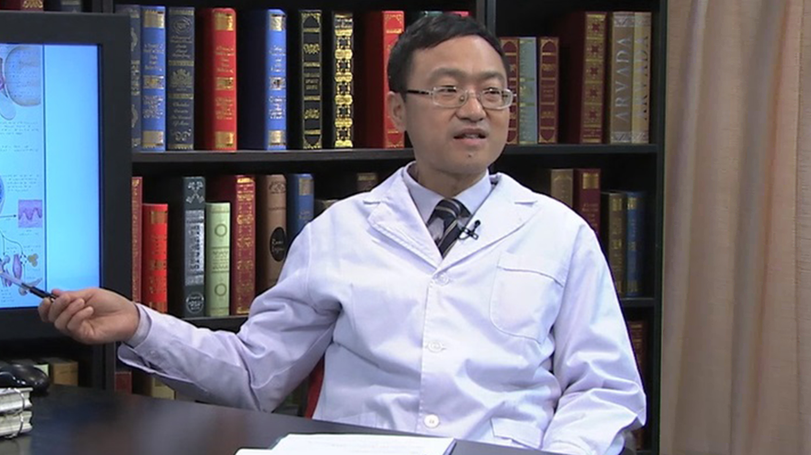

# 垂体瘤

---

## 钟历勇 主任医师

首都医科大学附属北京天坛医院内分泌科主任 主任医师 博士生导师；

首都医科大学内分泌与代谢学系副主任；中华医学会内分泌学分会全国委员；中华医学会内分泌学分会下丘脑-垂体学组副组长；中国医师协会内分泌代谢专科医师分会全国委员；北京医学会内分泌学分会常务委员；北京医师协会内分泌专科医师分会常务理事；北京医学会糖尿病学分会委员；国家卫计委脑卒中防治工程委员会中青年专家委会委员。

**主要成就：** 围绕神经内分泌学的相关基础与临床课题进行转化医学研究，近年主持与参与多项国家级、省部级科研课题的研究工作；发表SCI与核心刊物收录第一作者与责任作者学术论文90余篇；参加编写专著15部，主持或参与的国家级、省部级或校级课题10项。

**专业特长：** 临床擅长下丘脑－垂体－靶腺疾病、糖尿病及其慢性并发症诸如糖尿病神经病变、糖尿病肾脏病变及糖尿病伴缺血性卒中的综合诊治；对甲状腺疾病、痛风与高尿酸血症、肥胖症、高脂血症、多囊卵巢综合征、骨质疏松症和继发性高血压病等有独特的诊治经验。

---
