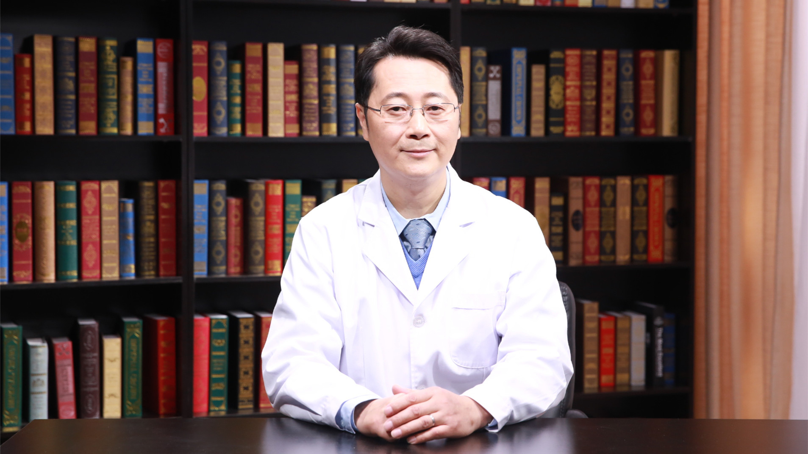

# 低血糖

---

## 周迎生 主任医师

首都医科大学附属北京安贞医院内分泌代谢科主任 主任医师 医学博士 博士生导师；

北京安贞医院内分泌代谢专业博士培养点负责人；首都医科大学内分泌代谢学系副主任；中华预防医学会糖尿病防控专业委员会主任委员；中国医师协会内分泌代谢科医师分会常务委员；北京医学会内分泌学分会常务委员。

**主要成就：** 主持国家自然科学基金、教育部及北京市等课题10余项；在冠心病合并糖尿病血糖控制管理方面有所建树，获得中华医学科技二等奖；在国内外医学期刊发表专业论文100多篇；担任人民卫生出版社《实用糖尿病学》专著第3、4版副主编。

**专业特长：** 擅长冠心病合并糖尿病血糖控制管理；糖尿病、肥胖、甲状腺疾病、痛风诊治及其心血管危险因素防控。

---
