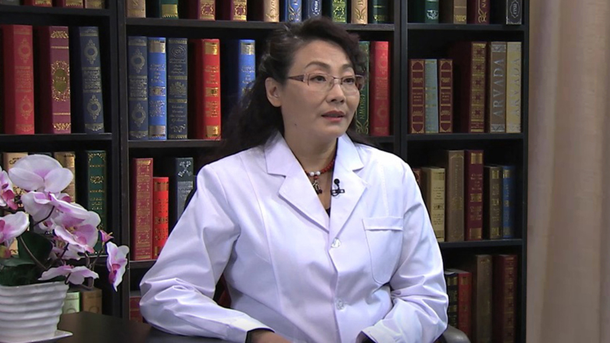

# 儿童糖尿病

---

## 巩纯秀 主任医师

首都医科大学附属北京儿童医院内分泌遗传代谢中心主任 主任医师 博士生导师 教授；

中华医学会糖尿病学1型糖尿病学组副组长；中华医学会儿科内分泌遗传代谢学组顾问；中华医学会青春期医学委员会副主任委员；中国医师协会内分泌代谢学分会常委；中国医师协会儿科内分泌遗传代谢学组组长；中国健康促进会罕见病学会委员；前亚太儿科内分泌学会理事会理事；中华儿科杂志编委；中华医药杂志常务编委；中华糖尿病杂志编委；中国糖尿病杂志编委；中国实用儿科杂志编委；中国小儿急救医学编委；Pediatric hormone research编委。

**主要成就：** 儿童糖尿病中华预防医学二等奖；儿糖尿病研究妇幼健康科技三等奖；生长相关的国家科技进步奖二等奖；2015中国十大糖尿病研究奖；承担国家及省部级基金等19项，发表专业论文200余篇，含SCI 20余篇；主编副主编《点燃希望儿童、青少年糖尿病管理指南》《儿科学》《Pediatrics》等10余部。

**专业特长：** 儿童糖尿病、生长和性腺疾病方面研究在儿科内分泌领域具有影响力。

---
