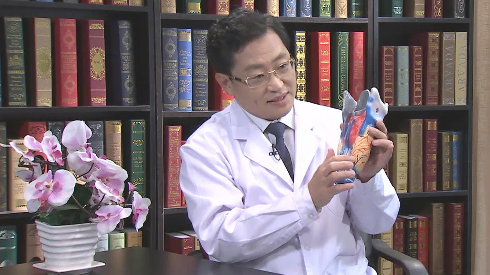

# 甲状旁腺肿瘤

---

## 魏伯俊 主任医师

首都医科大学附属北京朝阳医院甲状腺颈部外科主任 主任医师 教授；

原北京协和医院头颈外科专业创始人及首席专家；中国医促会甲状腺疾病专业委员会常委；中国医促会耳鼻咽喉头颈外科委员会委员；中国抗癌协会头颈肿瘤专业委员会委员；《中华耳鼻咽喉头颈外科杂志》编委；《中国耳鼻咽喉头颈外科》编委；《国际耳鼻咽喉头颈外科》编委。

**主要论文编著：** 在国内外专业期刊发表论文三十余篇；参编专业著作两部。

**专长特长：** 从事头颈外科近三十年，擅长头颈部肿瘤，特别是复杂甲状腺肿瘤和甲状旁腺肿瘤的外科治疗。先后成功实施国内首例侵犯咽喉和气管食管的甲状旁腺癌根治术及国内首例咽喉食管闭锁功能重建术。

---
