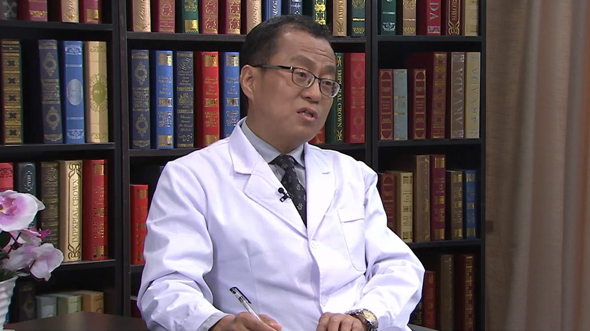

# 7.16 甲状腺功能亢进//宁志伟教授

---

## 宁志伟 主任医师

首都医科大学附属北京朝阳医院内分泌科主任医师；

中华骨质疏松与骨矿盐疾病学会诊断与质控学组委员；北京市骨质疏松与骨矿盐疾病分会委员；北京市自然科学基金评审专家；《中华骨质疏松与骨矿盐疾病杂志》审稿专家；国家食品药品监督管理局药审专家；美国内分泌学会会员。

**主要成就：** 在北京朝阳医院先后开设了甲状腺病和骨质疏松两个专病门诊；报道国内首例、第2例和第3例自身免疫性多内分泌腺病综合征1型；首先在国内开展MEN1基因突变检测，并发现两个新突变；首先报道北京城区居民维生素D缺乏高达87.1%，北京城区居民维生素D水平在4月份最低，10月份最高，女性低于男性；首先在国内应用60万单位负荷剂量维生素D3口服纠正维生素D缺乏；提出“要治疗骨质疏松，先纠正维生素D缺乏”的骨质疏松治疗理念；致力于维生素D缺乏的防治工作，申请国家发明专利一项。

**专业特长：** 擅长甲状腺病、代谢性骨病、妊娠相关内分泌疾病、维生素D缺乏。

---
