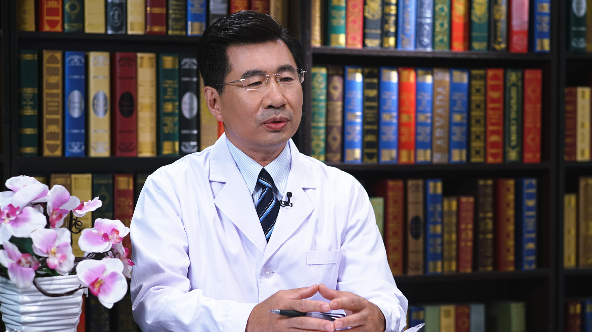

# 7.18 甲状腺结节微创治疗

---

## 钱林学 教授

首都医科大学附属北京友谊医院超声科主任 主任医师；首都医科大学超声科学系副主任；

中国医学装备协会超声装备分会会长；中华医学会超声分会委员；北京超声医学学会副会长；北京市高级卫生人才“百”层次。

**主要成就：** 曾获北京市科技进步3等奖，并获得国家级项目7项，省部级、局级项目10余项支持；发表SCI论文30余篇，累计影响因子60分，致力于甲状腺疾病的超声诊断及微创治疗；《中国医学装备》杂志主编，《Advanced Uitrsound in Diagnosis and Therapy 》《中国医学影像技术》副主编。

**专业特长：** 擅长超声介入治疗，包括肝癌射频消融、甲状腺及甲状旁腺微波消融、浅表淋巴结激光消融，尤其是甲状腺介入微创治疗，目前已完成该手术近2000台，无1例严重并发症发生。

---
