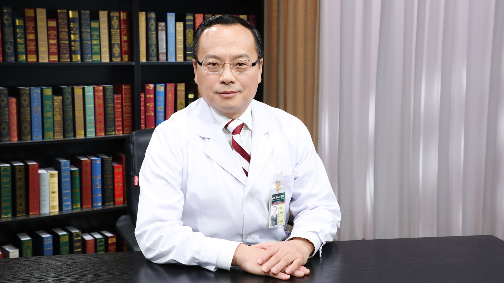

# 7.20 卡尔曼氏综合征

---

## 伍学焱 主任医师

中国医学科学院北京协和医院内分泌科主任医师 性腺组组长；

中国医学科学院北京协和医学院教授 博士研究生导师；中华医学会内分泌学分会性腺学组副组长；北京内分泌学分会常务委员；北京男科学分会副主任委员；国家食品药品监督管理总局食品安全风险评估专家组专家；《中华医学杂志》《中华内分泌代谢杂志》编委。

**主要成就：** 主持国家自然基金、北京自然基金和科技部罕见病研究基金，以及参与国家973等多项研究；发表学术论文200余篇，其中SCI论文60余篇；主编或参编学术专著多部；作为主要成员，参与处理我国2010年“奶粉-性早熟”事件，代表卫生部专家组，向社会新闻发布，为化解国家食品安全公共危机做出了重要贡献。

**专业特长：** 擅长糖尿病、甲状腺等内分泌常见疾病诊治；对下丘脑-垂体疾病、生长发育、生殖和衰老有深入研究。

---
