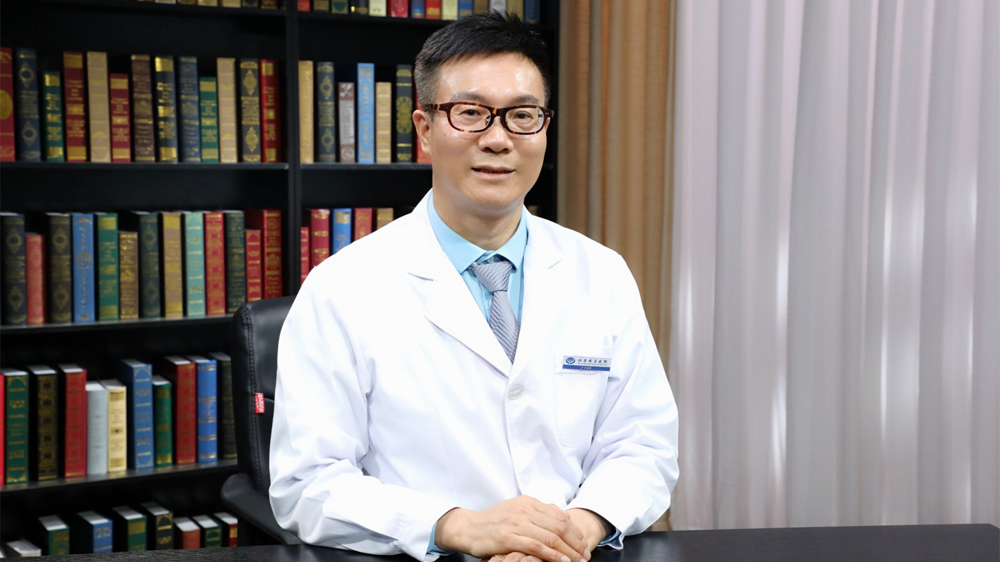

# 7.23 乳腺增生

---

## 骆成玉 主任医师

首都医科大学附属北京安贞医院普外科主任 主任医师 博士生导师；

中华医学会肿瘤学分会乳腺癌学组委员 ；世界内镜医师协会中国协会普通外科内镜与微创专业委员会理事 ；中国医师协会微无创分会乳腺专家委员会主任委员；中国整形美容协会科技创新与器官整复分会常务理事 ；北京市中西医结合学会普外专业委员会主任委员 ；中国研究型医院学会乳腺专业委员会副主任委员 ；中国整形美容协会肿瘤整复分会常委 。

**主要成就：** 担任国内外20余家杂志的编委、常务编委及特聘审稿专家，发表学术论文130余篇，主编专著3部；致力乳腺肿瘤微创与功能治疗以及腹腔镜微创手术的的基础与临床研究，国内最早期开展腹腔镜手术学者之一、实施乳腔镜手术数万例，被国内外誉为“乳腺微创之父”；获中华医学科技进步一等奖1项、军队科技进步二等奖1项、全国中青年普外学术交流一等奖3项。

**专业特长：** 擅长乳腺良性肿瘤微创手术、乳腺癌根治手术、乳腺癌保留乳房手术、乳腔镜腋窝淋巴微创清扫、奥美定等假体微创取出、男性乳房发育症微创切除、巨大乳腺癌广泛手术及术中和术后整形修复、乳房微创重建、乳腺癌综合治疗、各种腹腔镜微创手术、合并心脏病的普外疾病微创手术。

---
