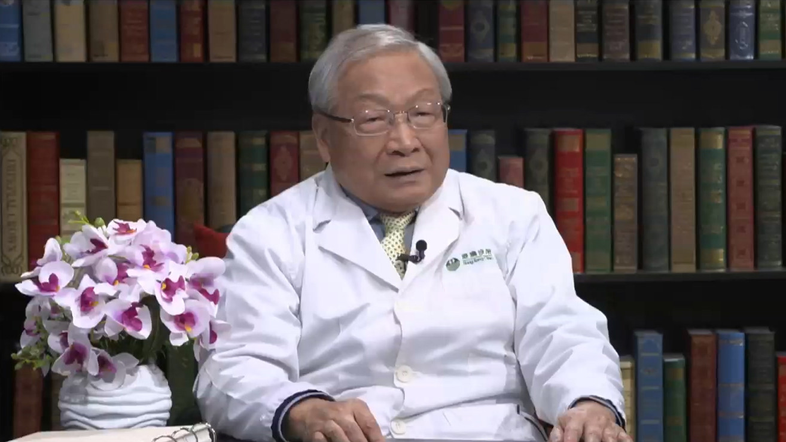

# 7.24 肾上腺意外瘤

---

## 陆召麟 主任医师

原北京协和医院院长 内分泌科主任医师 博士生导师；

原中国医学科学院北京协和医学院副校长；北京港澳国际医务诊所主任；享受政府特殊专家津贴；中央保健专家组成员。

**主要成就：** 曾荣获国家级和卫生部级科技进步一等奖；曾荣获国家人事部授予的“有突出贡献的中青年科学家”称号；发表各类内分泌学研究学术文章120余篇；主编《内分泌内科学》，参编《内分泌学高级教程2011》《实用内分泌学》《协和内分泌和代谢学》《现代内科学》《内科临床与进展》《糖尿病学》等专著。

**专业特长：** 从事内科和内分泌科临床工作五十多年，有着丰富的临床经验，在内分泌学的医疗、教学、研究及内分泌疾病的诊治方面尤为突出，对糖尿病、高血压、高血脂、高尿酸疾病、甲状腺疾病、肾上腺疾病和垂体疾病的诊断和治疗有着很深的造诣。

---
