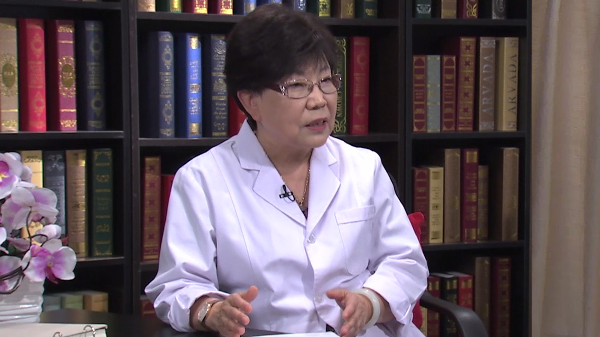

# 7.27 糖尿病//杨文英教授

---

## 杨文英 主任医师

中日友好医院内分泌代谢病中心主任 主任医师 大内科教研室主任 博士生及博士后导师；

曾任中华医学会糖尿病分会主任委员；现任亚洲糖尿病学会(AASD)副主席；现任中央保健会诊专家；《中华糖尿病杂志》荣誉主编。

**主要成就：** 2012年获北京市科技进步一等奖、中华医学会科技进步二等奖；2013年获首届亚洲糖尿病学会（AASD）糖尿病流行病学奖；2015年获中华医学会糖尿病分会科学贡献奖；近年已发表在国内、外核心期刊论文480余篇。

**专业特长：** 国内著名的内分泌专家，擅长治疗内分泌疑难病包括垂体病、甲状腺病、糖尿病、肥胖病等，特别在糖尿病领域有较深的造诣。主要从事中国糖尿病、代谢综合征等疾病的发病状况及发病因素的研究，同时专注脂毒性对糖尿病发病机制的基础研究。

---
