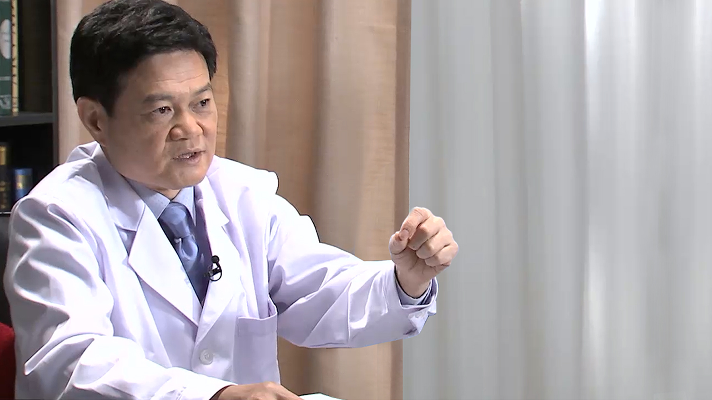

# 7.28 糖尿病//肖新华教授

---

## 肖新华 主任医师

北京协和医院内分泌科主任医师 博士生导师；

中国医学科学院糖尿病研究中心秘书长；中国老年保健协会糖尿病专业委员会副主委；中国糖尿病防治康复促进会（中国糖防会） 副会长；中华医学会糖尿病学分会委员兼糖尿病与肥胖学组副组长；中华中医药学会糖尿病分会常委；中央保健局中央保健会诊专家； 国家科技奖评审专家； 国家自然基金评审专家；教育部博士点基金评审专家；中华医学科技奖评审专家；北京中西医结合学会糖尿病专业委员会副主委；北京市科学技术奖励评审专家；现任兼任《Diabetes Research and Clinical Practice》中文版副主编、«Diabetes Metabolism Research and reviewer»、 《Chinese Medical Journal》英文版编委以及《中华糖尿病杂志》、《内科急危重杂志》和《国际糖尿病》等杂志编委。

**主要成就：** 主持申请多项国家级科研课题； 参与多部学术专著的编写，为《糖尿病现代治疗学》副主编；以第一或通讯作者发表论文及综述180余篇，其中发表在PNAS, Diabetes Care和Metabolism 等在内的Sci文章30余篇。

**专业特长：** 糖尿病的发病机制及早期防治，特殊糖尿病的分子遗传学研究。

---
