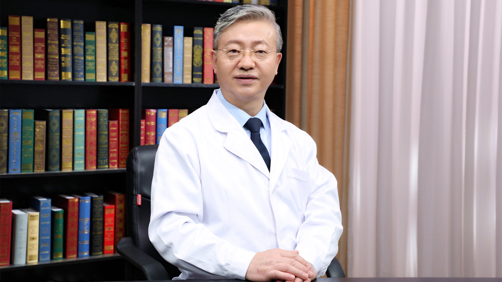

# 7.29 糖尿病//母义明教授

---

## 母义明 主任医师

解放军总医院内分泌科主任 主任医师 教授 博士生导师；

中华医学会内分泌学分会第十届委员会主任委员；中国医师协会内分泌代谢科分会候任会长；中国人民解放军医学会内分泌专业委员会主任委员；北京医学会内分泌学分会主任委员。

**主要成就：**  *Chronic Diseases and Translational Medicine* 《中华内科杂志》《中华内分泌代谢杂志》《中国医学前沿杂志》《中国实用内科杂志》《解放军医学杂志》副主编；发表SCI论文200余篇；2012年和2018年被中华医学会授予杰出贡献奖。

**专业特长：** 擅长糖尿病、垂体、甲状腺、甲状旁腺、肾上腺、性腺疾病及代谢性骨病（如骨质疏松症）等诊治。

---
