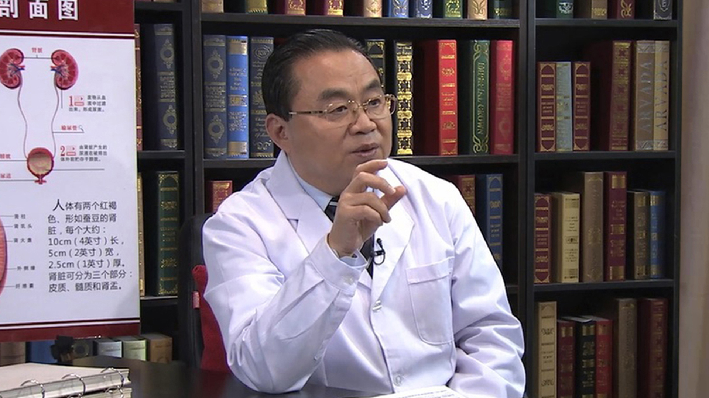

# 7.34 糖尿病肾病

---

北京中医药大学东方医院肾病糖尿病中心主任 教授 主任医师 博士生导师；

首都医科大学中医药学院院长；首都医科大学中医药研修院院长；首都医科大学代谢病研究中心主任；国家中医局重点学科内分泌学及肾病学学术带头人；中国糖尿病防治康复促进会会长；中华中医药学会糖尿病分会副主任委员；世界中医药联合会糖尿病专业委员会副会长。

**主要成就：** 长期致力于中医药防治糖尿病及肾脏病的临床研究，主持国家九五、十五、十一五攻关课题、973课题及省部级课题30余项,发表论文200余篇，主编专著20余部,获省部级科技进步奖6项，培养博士、硕士研究生70余名。

**专业特长：** 擅长于中医药、中西医结合治疗糖尿病及各种慢性并发症；急慢性肾炎；慢性肾衰；泌尿系感染；甲状腺疾病；内分泌疾病等。经验丰富，疗效显著。

---
