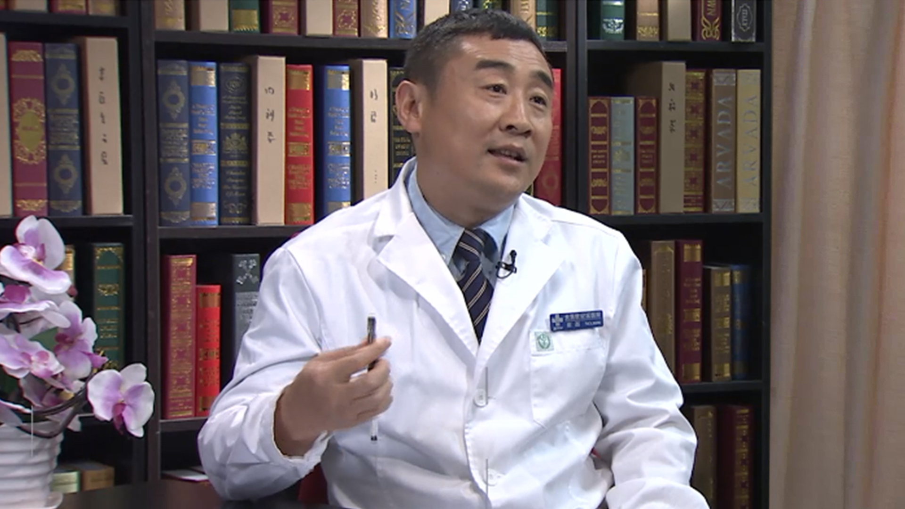

# 7.39 糖尿病足创面修复

---

## 崔磊 主任医师

首都医科大学附属北京世纪坛医院医学科学研究与转化中心主任 博士生导师；

整形美容外科与创面治疗中心学术带头人；中国整形美容协会抗衰老分会常务理事兼副秘书长；“中华医学科技奖”评审专家。

**主要成就：** 获国家技术发明⼆等奖、教育部科技进步⼆等奖等多项奖励；在创伤后伤口瘢痕形成机制、预防等方面获得多项国家级项目资助，具有多项研究成果；发表SCI论⽂48篇，文章总他引645次，单篇最高篇他引95次，作为副主编编写著作3部，参编外科权威著作《黄家驷外科学》。

**专业特长：** 擅长各种慢性创面的综合性处理；应用组织工程技术进行骨组织缺损的修复；股骨头坏死；骨不连等疑难病例的治疗及脂肪移植进行面部年轻化等美容⼿术。

---
