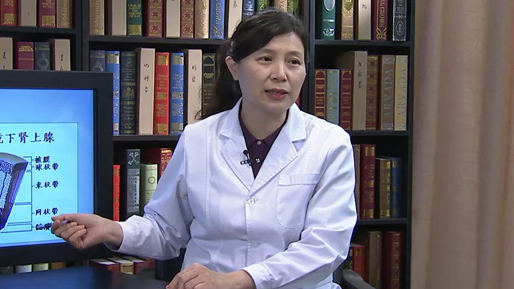

# 7.46 先天性肾上腺皮质增生症

---

## 陈晓波 主任医师

首都儿科研究所附属儿童医院内分泌科主任 主任医师 教授；

中华医学会北京儿科分会委员；中华医学会北京罕见病分会委员；中国医师学会内分泌分会委员；中国医疗保健国际交流促进会儿科学协会委员；中国妇幼健康学会肥胖控制学组常委；中国医师学会青春期医学委员。

**主要成就：** 发表文章30余篇，其中SCI2篇；主译《儿科内分泌学-诊治与实践》一部，参编儿科书籍5部。

**专业特长：** 擅长小儿内分泌疾病的诊治。

---
