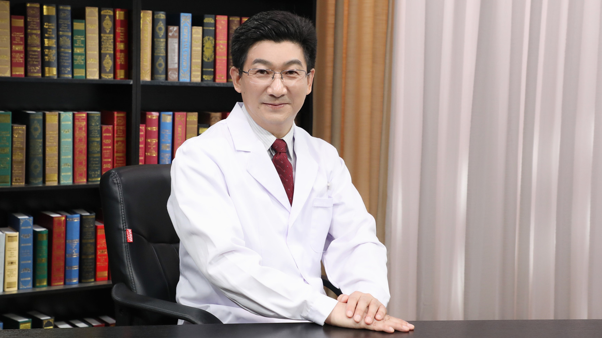

# 7.50 中西医结合治疗甲状腺炎

---

## 魏军平 主任医师

中国中医科学院广安门医院内分泌科主任医师 教授 医学博士 博士生导师 博士后合作导师；

中国中西医结合学会内分泌专业委员会主任委员；中国民族医药学会内分泌分会副会长；国家中医临床研究基地中医药防治糖尿病临床研究联盟副主任委员；中华医学会内分泌学会中西医结合学组委员；北京中医药学会第十二届监事会监事长。

**主要成就：** 主持完成世界卫生组织、国家自然科学基金、中华人民共和国国家卫生健康委员会保健局、国家中医药管理局、首都卫生发展科研专项、北京市自然科学基金、北京市中医药科技项目等30余项；获中国中西医结合学会科学技术奖一等奖2项、二等奖2项、三等奖3项，中华中医药学会科学技术奖二等奖2项、三等奖1项，北京市科技进步二等奖、三等奖各1项，首都职工优秀技术创新成果奖1项，中国中医科学院科技进步二等奖1项，中国中医药研究促进会一等奖1项；负责《用于2型糖尿病的传统医学临床实践指南》（WHO西太区）、《中国中西医结合糖尿病诊疗规范》《中国中医糖尿病防治指南》《中医内科常见病诊疗指南》（内分泌代谢病）起草和审定工作；主参编书籍29部，发表科研学术论文155篇。

**专业特长：** 擅长中西医结合治疗糖尿病及慢性并发症以及甲状腺疾病、痛风与高尿酸血症、高脂血症、脂肪肝、高血压、肥胖、失眠、便秘、更年期综合征、多囊卵巢综合征等。

---
