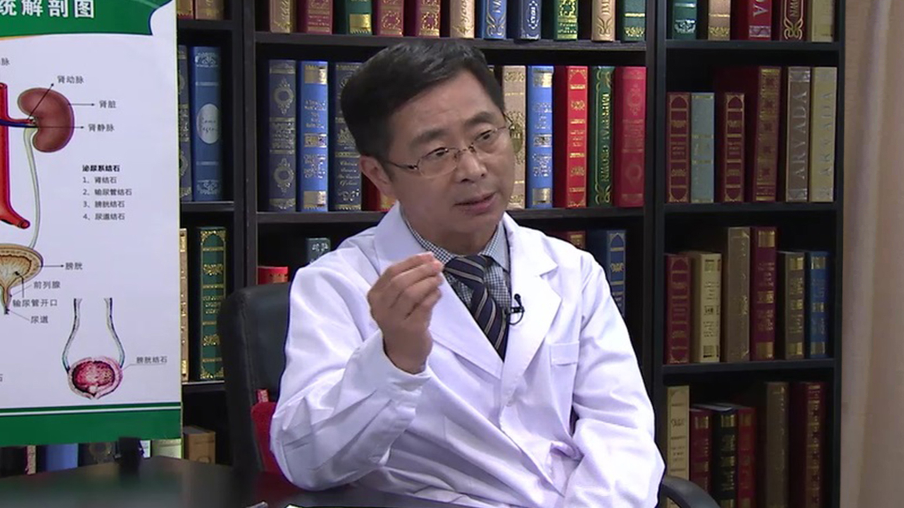

# 8.1 膀胱肿瘤

---

## 息金波 主任医师

北京中医药大学第三附属医院 泌尿外科主任 主任医师 研究生导师；

北京中西医泌尿外科学会委员；医疗技术鉴定专家委员会委员；上海男性康复协会委员。

**主要成就：** 应用自行研制的“多功能尿路支架管”所做的尿道下裂一期修复成型术，居国内先进水平；率先提出精索静脉曲张不育症睾丸功能障碍活性氧机制学说，并被美国CA收录；发表论文37余篇；科研成果4项，主持省部级科研项目两项；多次获“十佳医生”称号；曾获外科技术比赛“外科岗位技术能手”第一名。

**专业特长：** 擅长肾癌、膀胱癌、前列腺癌等诊治与手术；泌尿外科微创手术；泌尿系结石微创及中西医结合治疗；输尿管镜、经皮肾镜、腹腔镜等诊断与治疗；泌尿生殖器畸形矫正（肾盂成形、尿道下裂修复等）；尿失禁微创治疗（TVT等）；泌尿生殖系感染（肾盂肾炎、膀胱炎及前列腺炎等）；男性性功能障碍及不育等。

---
