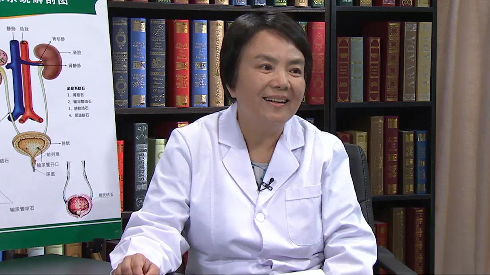

# 8.2 CKD（慢性肾脏病）

---

## 吴华主任医师

北京医院肾内科主任医师；北京医院老年病研究所硕士研究生导师；

中华医学会肾脏病学分会委员；中国医师协会肾脏内科医师分会委员；中国医院协会血液净化中心管理分会委员；北京医学会肾脏病学分会副主任委员；北京市血液净化质量控制和改进中心专家组成员；北京医学会医疗事故技术鉴定专家库成员；中央保健会诊专家。

**主要成就：** 2011年7月被聘为北京市卫生局首批健康科普专家；承担过北京大学医学部八年制基础医学系、口腔系、医疗系的肾脏病学教学工作。

**专业特长：** 熟知老年急性肾衰和慢性肾衰的诊断治疗及各型肾炎治疗的特点，精通血液净化技术，擅长各种急性、慢性肾小球肾炎、肾病综合征、IgA肾病、肾动脉狭窄、老年肾脏疾病及各种继发性肾脏疾病的治疗。

---
