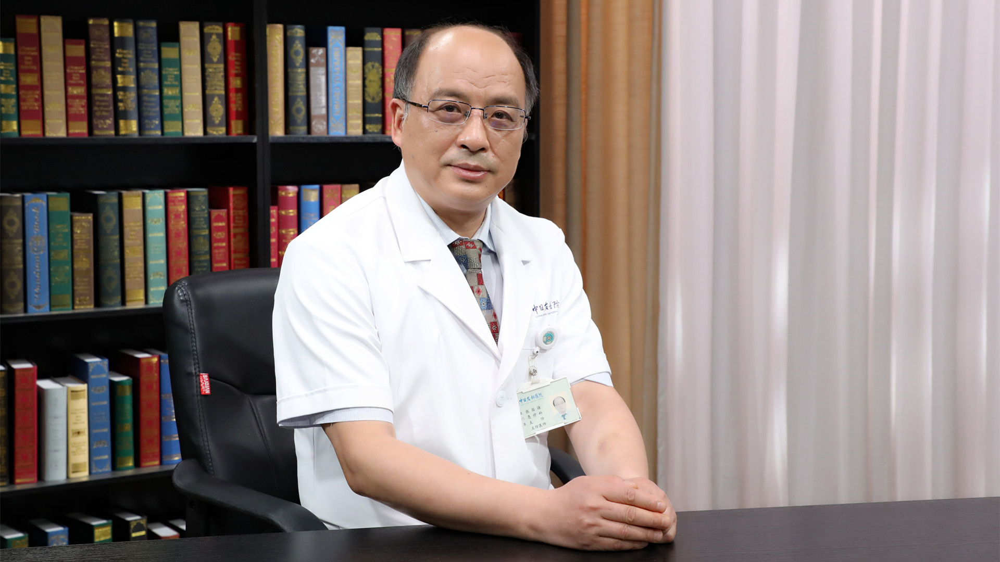

# 8.6 横纹肌溶解综合征

---

## 张国强 主任医师

中日友好医院急诊科主任 主任医师 教授 博士生导师；

中华医学会急诊医学分会候任主任委员；北京医学会急诊专业委员会主任委员；北京医师协会急诊专科医师协会副会长。

**主要成就：** 承担科技部重大专项课题1项，国家自然科学基金面上项目3项，省部级课题1项；共发表学术论文80余篇，其中SCI近20篇，主编和参编10余部专业著作；任《中华急诊医学杂志》《中华危重病急救医学》副总编、《实用休克杂志（中英文）》常务编委、《中华老年医学杂志》《中国急救医学》《中国急救复苏与灾害医学杂志》*World Journal of Emergency Medicine *编委；曾获“全国先进工作者”荣誉称号、中央国家机关“五一”劳动奖章。

**专业特长：** 研究方向为心肺复苏、危重急症、多器官功能衰竭、床旁超声。

---
