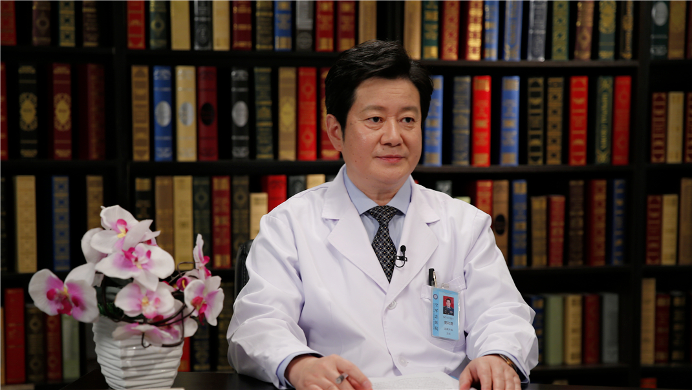

# 8.11 良性前列腺增生手术治疗

---

## 郭和清 主任医师

空军总医院泌尿外科主任 全军泌尿微创诊疗中心主任 主任医师 博士后指导导师；

空军泌尿外科学专业委员会主任委员；全军泌尿外科专业委员会常务委员；空军医学科技委员会外科专业委员会副主任委员。

**主要成就：** “飞行人员上尿路结石临床微创技术应用研究”军队科技进步二等奖；“人膀胱癌多药耐受的基础及临床研究”获中华医学科技三等奖；“协同逆转膀胱癌多重抗药性实验研究与临床引用探索”获军队科技进步三等奖；“全胰、肾一期联合移植”获军队医疗成果三等奖；主编专著《经尿道微创手术技术》；发表SCI及核心期刊论文80余篇。

**专业特长：** 擅长泌尿系统疾病微创治疗，肾脏移植，飞行人员泌尿系统疾病治疗及医学鉴定。

---
