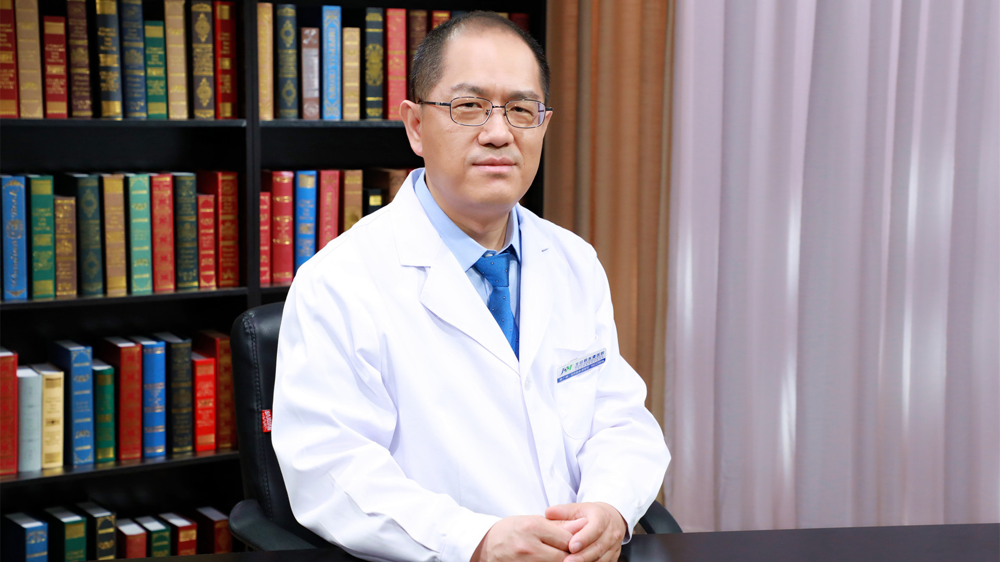

# 8.17 尿道损伤修复

---

## 黄广林 主任医师

北京积水潭医院泌尿外科主任医师 副教授 医学博士。

中国医师协会男科医师分会男性外生殖器整形与康复专业委员会副主任委员；中国医疗保健国际交流促进会健康科普分会全国委员；北京医学会泌尿外科学分会尿路修复与重建学组副组长；世界华人医师协会智慧医疗委员会常务委员。

**主要成就：** 长期从事泌尿外科组织工程的研究工作，发表核心期刊及SCI期刊论文20余篇；参与编写专业书籍4部；曾赴英国伦敦大学学院医院及意大利尿道修复重建外科中心专门进修学习尿道修复重建技术。

**专业特长：** 擅长尿道损伤及尿道狭窄与闭锁的诊治工作；擅长软镜下尿道会师术、经会阴及经耻骨后尿道吻合术、口腔黏膜/结肠黏膜尿道成形术、带蒂皮瓣尿道成形术、复杂尿瘘修补术、尿道狭窄切开术、尿道闭锁旋切术、会阴部尿道造口术等手术。

---
