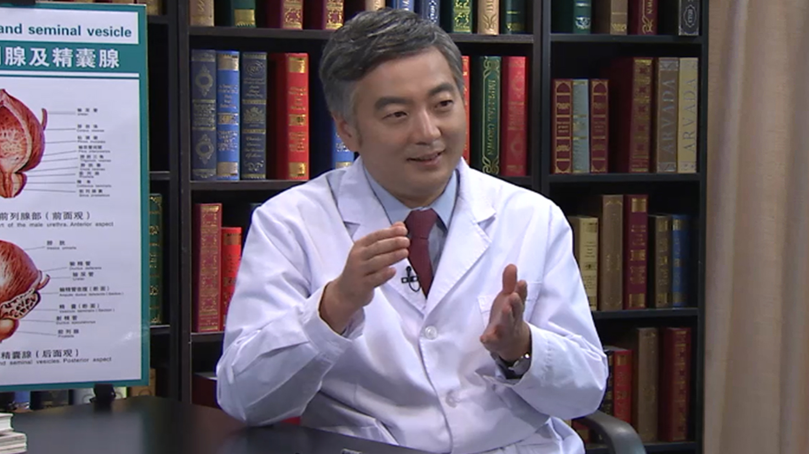

# 8.26 前列腺癌//邢念增教授

---

## 邢念增 主任医师

国家癌症中心 中国医学科学院肿瘤医院  泌尿外科主任 主任医师 博士研究生导师 。

全国政协委员；中国医师协会泌尿外科分会副会长兼总干事；中国医师协会泌尿腔镜委员会副秘书长；中国医促会泌尿生殖委员会副主任委员；北京医学会泌尿外科分会副主任委员兼泌尿微创专家组组长。

**主要成就：** ＂百千万人才工程＂国家级人选，国家＂有突出贡献中青年专家＂；获中国国家发明及实用新型专利五项，美国专利一项；获北京市科技进步奖、华夏医学科技等省部级科技进步奖等近10项；曾获得北京市科技新星、北京市卫生系统高层次人才工程泌尿外科学科带头人、北京市“杨帆”计划、北京市“登峰”计划、首都科技领军人才工程等人才培养项目支持；在国内外权威杂志上发表相关专业论文220余篇，其中SCI收录的论文50余篇。

**专业特长：** 擅长泌尿系肿瘤的诊治及泌尿微创手术，多项技术处于国内或国际先进水平。长期工作在医疗第一线，对泌尿外科疑难及危重症有丰富的诊治经验。

---
