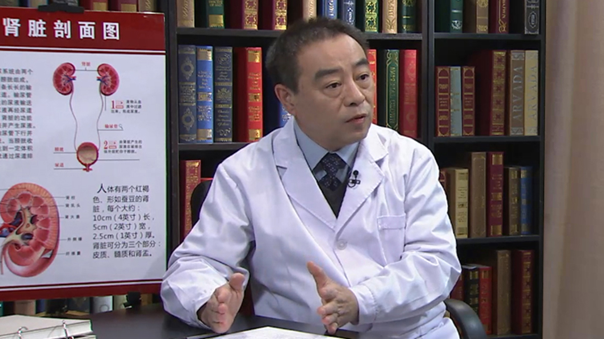

# 8.30 肾癌//马建辉教授

---

## 马建辉 主任医师

中国医学科学院肿瘤医院泌尿外科主任医师 教授 医务处处长。

中国抗癌协会临床肿瘤学协作专业委员会肾癌专家委员会主任委员，教育部归国人员科研启动基金评审专家，《中国肾癌诊治指南》主编，《中华肿瘤杂志》编委，《中华泌尿外科杂志》编委。

**主要成就：** 先后承担了北京市科委首都特色膀胱癌分子细胞遗传学在膀胱癌早诊及术后检测的研究课题，国家一类新药安罗替尼治疗晚期肾癌的Ⅰ期、Ⅱ期临床研究等课题；在《中华肿瘤杂志》《中华泌尿外科杂志》等期刊和报纸上发表文章100余篇，参与了《黄家驷外科学》《吴阶平泌尿外科学》等20余本专著的编写。

**专业特长：** 熟练掌握男性泌尿生殖系肿瘤理论和外科技能，如保留性神经的前列腺癌根治术和全膀胱切除术、保留肾单位的肾癌手术以及下腔静脉瘤栓取出术等泌尿外科高难度手术。

---
