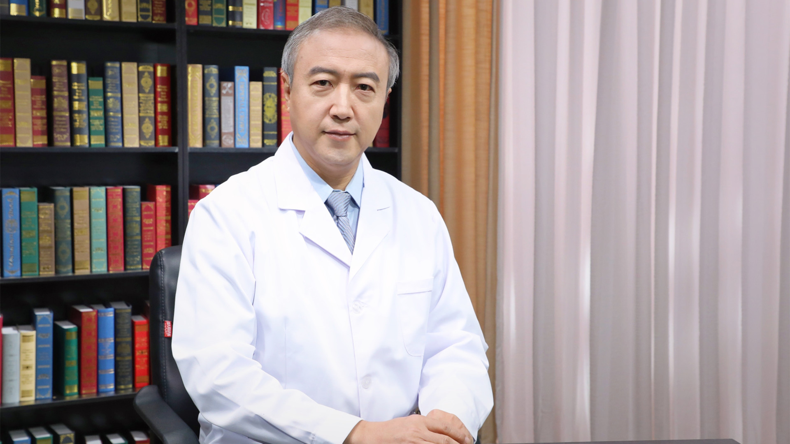

# 8.33 肾淀粉样变性病

---

## 刘刚 主任医师

北京大学第一医院大内科副主任 主任医师 教授 博士生导师 医学博士。

国家执业医师资格考试肾脏专业命题专家组负责人；国际肾脏病学会（ISN）肾脏病理委员会委员 东北亚地区委员会委员；北京市住院医师规范化培训委员会委员。

**主要成就：** 获得4次北京大学医学部优秀教师、2015年度北京大学优秀教师及2017年度北京市优秀教师；作为第一作者或责任作者，在 *Kidney Internationa* l等杂志上发表SCI收录论文20余篇；为* Curr Opin Nephrol Hypertens* 等撰写特邀综述；参编专著15部。

**专业特长：** 擅长肾脏疾病临床诊治、肾脏病理和医学教育。

---
