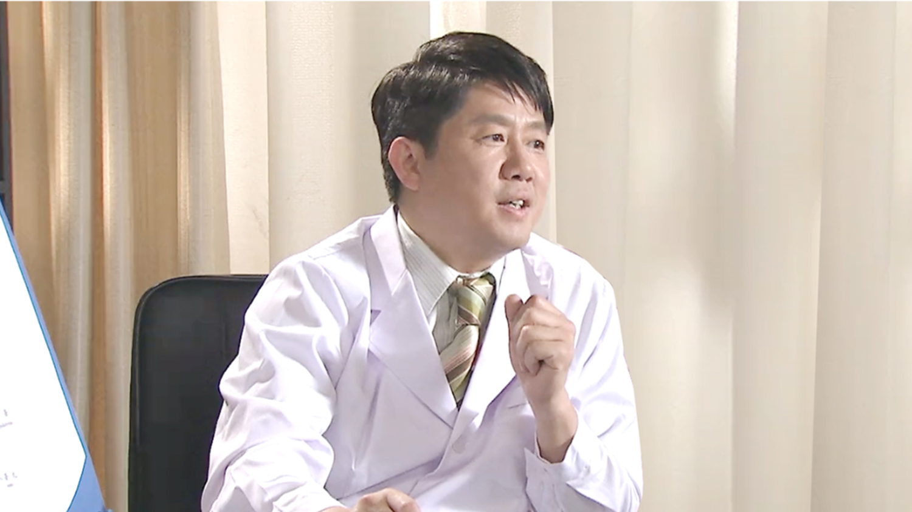

# 8.35 肾结石

---

## 张弋 主任医师

北京大学国际医院泌尿外科 主任医师 副教授。

北京医学会泌尿外科学分会第十届委员会委员；北京市医学会泌尿外科学分会-结石与感染学组委员；北京市医师协会泌尿外科学分会泌尿外科专科医师（第一批认证）；中华泌尿外科杂志通讯编委；现代泌尿外科杂志青年编委；SM Journal of Urology, 美国编委；中华医学会泌尿外科学分会第一届青年委员会委员；中华医学会泌尿外科学分会第一届国际交流委员会委员；中国泌尿外科内镜技能考核准入制定工作组专家；北京市自然科学基金评审专家；中欧泌尿外科联合培训项目授课专家；中欧高级联合培训-泌尿系结石大师班授课专家；中华临床医师杂志（电子版），International Brazilian Journal of Urology, Urology Journal, Cancer Management & Research, Research & Reports in Urology, Therapeutics & Clinical Risk Management等杂志评阅专家；北京市泌尿系结石沙龙发起人负责人。

**专业特长：** 对于泌尿系结石、肿瘤、尿控学、男科学和女性泌尿学等疾病的诊治方面有着丰富经验，熟练运用多种泌尿内腔镜，进行专科诊断治疗。

---
