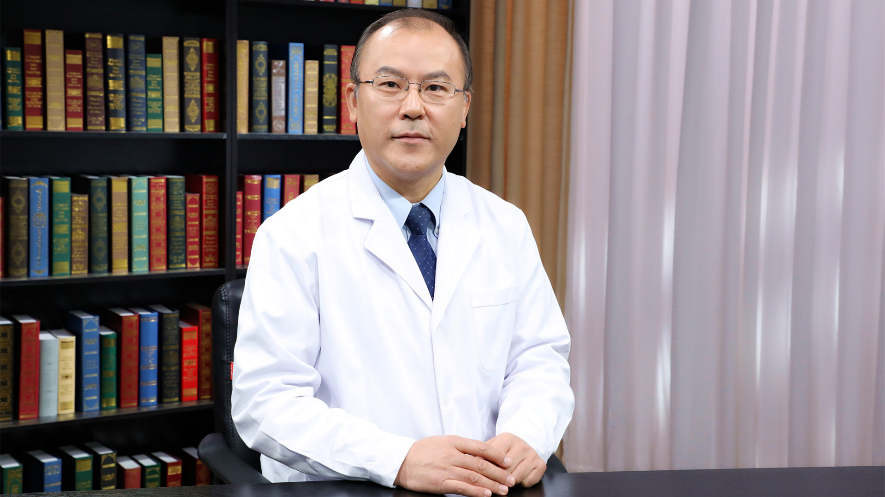

# 8.36 肾结石的手术治疗

---

## 李建兴 主任医师

清华大学附属北京清华长庚医院泌尿外科主任 外科部副部长 主任医师。

中华医学会泌尿外科分会结石学组秘书长；中国华北泌尿结石病防治基地主任委员；中国医疗保健国际交流促进会健康泌尿分会副主任委员；中国尿石联盟副主席；中国妇幼学会新生儿与泌尿学组副主任委员；北京市医学会泌尿外科分会副主任委员。

**主要成就：** 率先倡导并推广了B超定位经皮肾镜技术；创新性提出“两步法”建立标准通道经皮肾镜技术；创新性提出一体可弯软硬质肾镜及Needle-perc新技术；近年将超声定位经皮肾镜技术推广至国外，先后在欧洲、美国、南非、东南亚等国家或地区进行数十次学术讲座及手术演示；科研学术成果先后获北京医学科技二等奖、中华医学科教三等奖、华夏医学科教一等奖。

**专业特长：** 擅长腔内泌尿外科微创技术，包括复杂泌尿系结石的腔内治疗、泌尿系肿瘤的腹腔镜微创治疗、前列腺增生经尿道剜除手术等。在国内较早开展了经尿道手术、经皮肾镜手术、泌尿外科腹腔镜手术。

---
